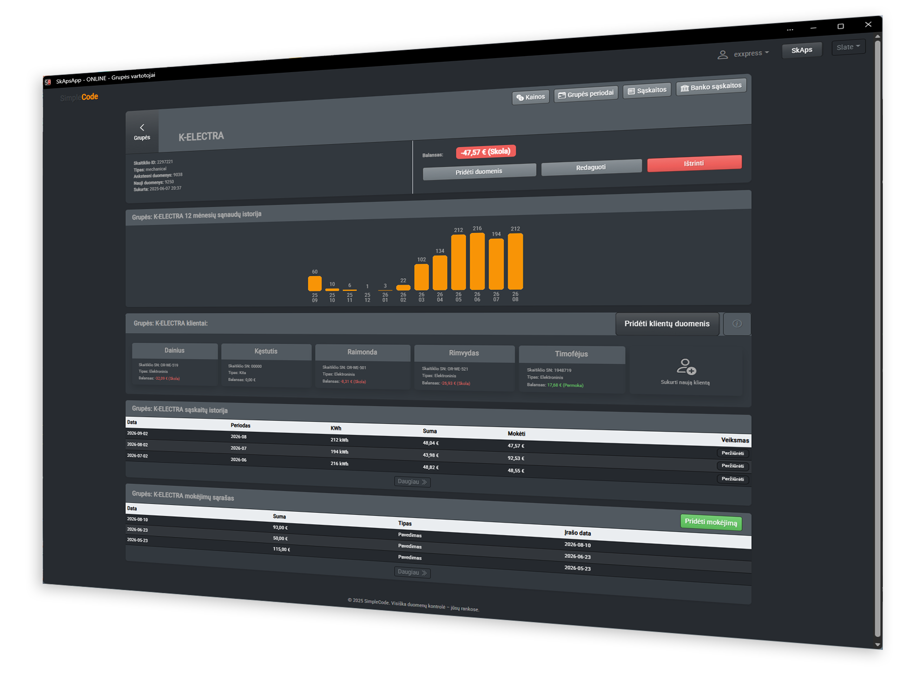
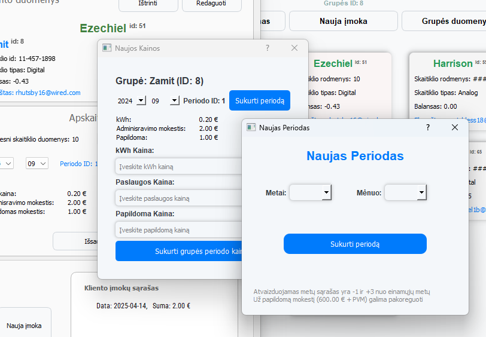
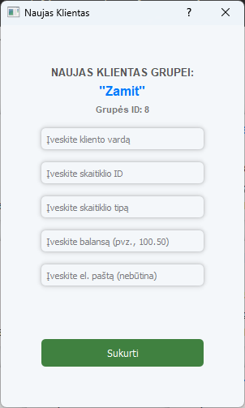
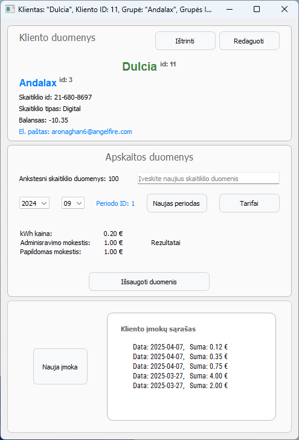
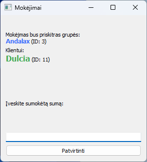
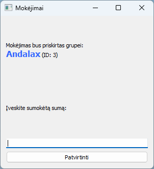
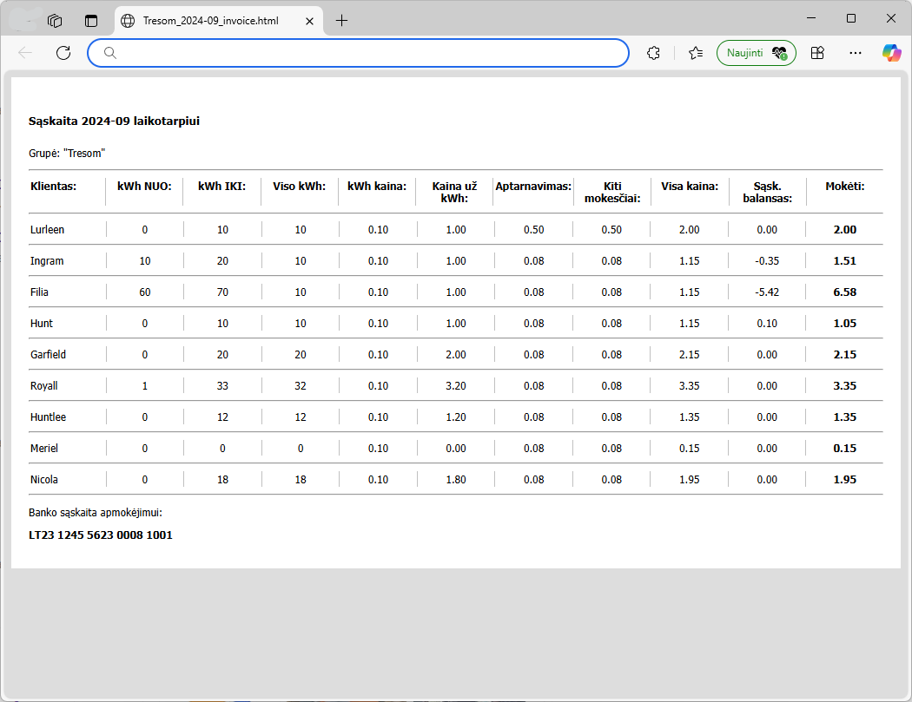
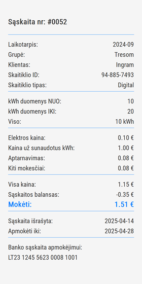
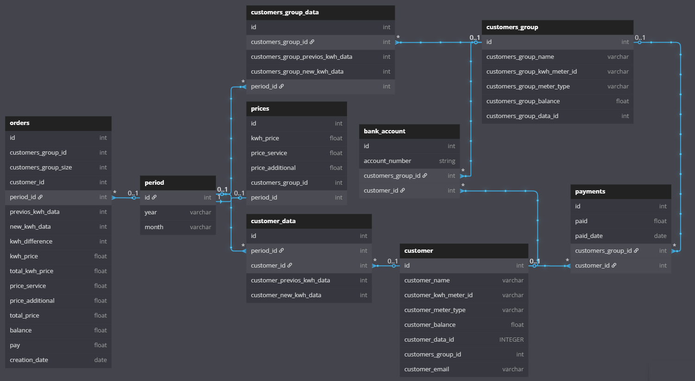

# SkAps - Skaitiklių Apskaitos Programa (django)

# SkAps - Skaitiklių Apskaitos Programa (PyQT)

## Aprašymas

Programa yra subalansuota mažų bendrijų elektros ar vandens skaitiklių apskaitai.

**SkAps** yra skaitiklių apskaitos programa, sukurta naudojant Python, PyQt ir SQLite duomenų bazę. Ji apima įvairias
funkcijas, skirtas valdyti grupes, periodus, klientus, jų duomenis, mokėjimus ir sąskaitas. 

## Funkcijos

- **Grupių valdymas**: Kurkite, redaguokite ir peržiūrėkite grupes.

- **Periodų valdymas**: Valdykite apskaitos periodus.

- **Klientų valdymas**: Kurkite naujus klientus.

- **Duomenų valdymas**: Peržiūrėkite klientų informaciją, Tvarkykite, redaguokite jų duomenis.

**Mokėjimų valdymas**: Sekite ir valdykite mokėjimus.

 

- **Sąskaitų valdymas**: Generuokite ir tvarkykite sąskaitas.

## Naudojimas

1. **Grupių sąrašo peržiūra**: Grupės rodomos su jų pavadinimu, ID, klientų skaičiumi, skaitiklio ID ir tipu, bei grupės
   sąskaitos likučiu.
2. ...

## Technologijos

- **Python**
- **PyQt5**
- **SQLite**
- **SQLAlchemy** (duomenų bazės valdymui)

